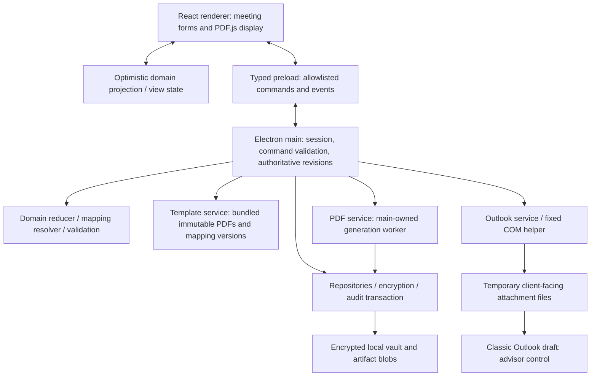

# Architecture

## K. Tech stack decision

**Recommend Electron + React + TypeScript**, conditional on the PDF feasibility gate. This honors the preferred stack and keeps UI, domain types and PDF configuration in one language. The meaningful alternative is .NET if Windows integration becomes the dominant concern; swapping shells does not eliminate interactive PDF work.

| Criterion | Electron | Tauri | Native .NET WPF/WinUI |
|---|---|---|---|
| Stage 1 delivery | Best fit for requested React/TS workflow | Similar web UI, plus Rust integration | Strong if team already has desktop C# expertise |
| PDF interaction | Bundled Chromium + PDF.js; pdf-lib in main-owned service | PDF.js in platform webview; privileged bridge still needed | WebView2/PDF.js or separately evaluated native/commercial PDF SDK |
| Local filesystem/security | Mature Node/OS integration; narrow IPC essential | Rust commands/capabilities; platform webview | Native Windows APIs and DPAPI; explicit UI/privileged separation still useful |
| Outlook | Fixed COM helper | Rust/native/helper bridge | Direct managed COM integration is a strong advantage |
| UI polish | React component ecosystem, consistent renderer | React ecosystem; WebView2 dependency | Native controls; separate design/implementation skill set |
| Distribution cost | Larger bundle/memory footprint | Smaller app host; runtime availability matters | Windows-only; .NET/runtime/packaging choice |

This assessment is an architectural recommendation, not a measured benchmark. [Tauri's architecture](https://v2.tauri.app/concept/architecture/) describes its Rust core and webview model; [WPF's overview](https://learn.microsoft.com/en-us/dotnet/desktop/wpf/overview/) describes its Windows UI platform. [Electron security guidance](https://www.electronjs.org/docs/latest/tutorial/security) informs the boundary design below.

### Proposed dependencies

| Dependency | Responsibility / constraint |
|---|---|
| Electron | Windows host, sandboxed renderer, typed preload, local safeStorage |
| React + TypeScript | Meeting UI and shared domain contracts |
| Vite / electron-vite | Local development/build tooling; dev server absent from packaged runtime |
| `pdfjs-dist` | Locally bundled worker/viewer assets and interactive display adapter |
| `pdf-lib` + optional `@pdf-lib/fontkit` | Main-owned field writing and embedded font appearance generation; fontkit only if needed for supported names |
| Zustand | Renderer projection and view preferences; no persistence middleware for PII |
| Zod | IPC, mapping and storage envelope schemas; semantic validation remains domain rules |
| React Hook Form | Grouped dynamic entry, draft input/error display; source of truth stays domain state |
| Tailwind CSS 4 + locally owned shadcn/ui (Radix) | Semantic local tokens and accessible owned primitives; customized navy/light design |
| lucide-react + local Segoe UI | Bundled named SVG icons and Windows font stack; no remote assets |
| CSS transitions | Brief meaningful transitions with reduced-motion support; no Motion dependency in Stage 1 |
| Node `crypto`, `fs`, `child_process` | Main-only encryption, atomic persistence, fixed helper launch |
| Fixed Windows PowerShell 5.1 helper | Classic Outlook COM draft; structured input, hidden process window |
| Vitest + Testing Library | Domain/mapping/component tests |
| Playwright Electron support | Packaged/development smoke tests with synthetic fixtures |
| electron-builder | Windows unpacked artifact and per-user installer/EXE; no auto-updater in Stage 1 |

Pin versions together after M0 verifies compatibility and current security support. pdf-lib 1.17.1 is the version used for read-only inspection, not a blanket approval of future deployment. Record dependency/font licenses and build hashes; no network-loaded fonts, CDN assets or PDF workers. XState is unnecessary initially; a typed reducer can express the bounded state machine.

Frontend alternatives and rationale: [frontend design ADR](decisions/2026-09-15-frontend-design-system.md). Exact tokens, components and display geometry: [visual design system](specs/2026-09-15-visual-design-system.md).

## L. Application architecture



The privileged layer owns file paths, keys, audit, authorization, output and Outlook. PDF.js gets only bytes for selected allowlisted templates/documents, not filesystem access. The pure domain package is shared for optimistic display, but only main can authorize, persist, verify, approve or finalize. The renderer may hold plaintext in memory while editing; that is necessary for display and is not treated as encrypted persistence.

### Service responsibilities

- **TemplateService:** enumerate bundled catalog, verify hashes/schema, map field names/types/locations, expose metadata. No user PDF upload/import in Stage 1.
- **CaseService:** serialize typed commands, enforce active session and expected revision, calculate effective values, save state and value-free audit together.
- **MappingEngine:** derive fields, format values, apply overrides/defaults/applicability, and translate semantic choices to all member widget values.
- **ValidationEngine:** deterministic preparation checks and navigation targets from effective document state; no suitability engine.
- **PdfService:** load fresh approved template bytes, apply effective values and appearance updates in memory, prepare audience-specific copies, reopen/verify, encrypt artifacts and return IDs. CPU work can run in a main-owned worker thread; workers get no renderer-supplied paths or keys beyond the narrowly needed operation.
- **Repository/EncryptionService:** authenticate/encrypt envelopes, handle atomic persistence and recovery, never let renderer choose files.
- **AuditService:** allowlisted metadata events with sequence/revision; encrypted with state; no raw values or exception payloads.
- **OutlookService:** validate finalized client artifact IDs, stage attachments and launch fixed helper; return structured known success/failure/uncertain status.

### Presentation and host policy

Presentation Mode is renderer view state, not authorization or redaction. Versioned mapping metadata classifies sensitive bindings/internal-only pages; rule issues inherit audience classification so filtered views cannot leak internal snippets. Main continues full validation regardless of view filtering. SecureField and the PDF adapter apply the same declared interaction restrictions; no generic clipboard, print, drag or deep-link bridge is exposed. Main owns OS lock/suspend/background session revocation and rejects stale operations. Concrete controls/limitations are in [security](SECURITY.md#practical-windows-gap-review-2026-09-15).

### Typed preload examples (conceptual)

Expose `login`, `listTemplates`, `listDemoClients`, `createCase`, `openCase`, `applyCaseCommand`, `getDocumentView`, `verifyCase`, `acknowledgeWarning`, `approveCase`, `finalizeCase`, `prepareEmail`, `exportPackage`, `lock`. Commands use IDs, expected revisions and validated enums; main resolves paths. Reject unknown properties, oversized payloads, unselected-document edits, signature writes, stale sessions and commands from unexpected webContents/frames. Do not expose `ipcRenderer`, generic invoke, filesystem read/write, executable names or shell arguments.

### PDF display and output

PDF.js supports form annotation storage, but storage alone is not a guarantee that a currently mounted field rerenders. Use a focused display adapter to bind each widget to semantic effective state and update both mounted controls and annotation storage, tagging programmatic updates to prevent input loops. [PDF.js document API](https://mozilla.github.io/pdf.js/api/draft/module-pdfjsLib-PDFDocumentProxy.html) documents annotation storage; the exact supported integration is pinned and tested in M0.

Primary option: use PDF.js annotation widgets with controlled event capture/patching. Fallback within scope: PDF.js canvas/text layer plus our accessible text/checkbox overlays at its annotation rectangles for these supported field types. Only select the fallback if it preserves precise zoom/scroll alignment and keyboard editing. Do not rely on a Chromium built-in PDF iframe, whose input cannot reliably express app overrides.

Keep bytes unchanged during routine editing; update lightweight widget state. Export reads canonical effective values into a fresh template copy, uses the actual `/1` on states, regenerates readable on/off appearances, embeds an approved local font when needed, and checks output values AND rendered marks. Do not let PDF.js save and pdf-lib save become competing serializers. Do not execute form scripts.

Stage 1 output policy: set ordinary preparation fields read-only; preserve empty client signature/date fields, including tagged text placeholders and `/Sig`. Full flattening is deferred. Read-only is convenience, not evidence of tamper resistance. If a downstream signing system requires selective flattening, implement it only after that contract is confirmed; M0 explores feasibility and records the decision.

Intake client pages 1-6 are a proposed subset. Copying pages can lose AcroForm relationships; verify field tree and widgets after export. An audience subset must remove excluded internal values, orphan fields, unused objects and reachable metadata, not merely hide a page. M0 must prove that page 7's fee data is absent from the client file, including its field tree, before the finalizer can support this policy. Preserve consent page 1. Keep documents separate to avoid duplicate consent field names colliding in a merge.

### Outlook service

**Recommended Stage 1 bridge:** main starts the system Windows PowerShell executable using a fixed packaged `.ps1` file with `-NoProfile -NonInteractive -STA -File`, argument arrays, no shell interpolation and a hidden process window. Send a size-limited JSON request through standard input or a similarly bounded local pipe; never place names, recipients, body text or secrets in command-line arguments. No `Invoke-Expression`, dynamic scripts, command strings or renderer-chosen paths. If firm policy blocks scripts, evaluate a small signed C# COM helper behind the same service; do not bypass policy.

The helper creates `Outlook.Application` (which can launch Classic Outlook if installed/configured), creates a MailItem, assigns To/Subject/plain-text Body, saves it, adds each attachment by value, saves again, then calls `Display(false)`. It returns a request correlation ID and opaque draft identifier only after success. Microsoft documents [MailItem.Save](https://learn.microsoft.com/en-us/office/vba/api/outlook.mailitem.save), [Attachments.Add](https://learn.microsoft.com/en-us/office/vba/api/outlook.attachments.add), and [MailItem.Display](https://learn.microsoft.com/en-us/office/vba/api/outlook.mailitem.display). No Send call, SendKeys, scheduled send, SMTP or Graph capability exists.

New Outlook does not support the Outlook Object Model according to [Microsoft's feature comparison](https://support.microsoft.com/en-us/outlook/getstarted/feature-comparison-between-new-outlook-and-classic-outlook); it is not a substitute for the specified Classic Outlook target. Enterprise policies can also trigger restrictions/prompts; [Microsoft's security discussion](https://learn.microsoft.com/en-us/visualstudio/vsto/specific-security-considerations-for-office-solutions?view=visualstudio) documents Object Model Guard considerations.

Use an operation ID, serialized requests and disabled double-click during preparation. Persist handoff intent before launching. Save and verify attachment count/names/sizes and, in the integration test, byte content by reopening the saved draft and extracting attachments to a test directory. Only then release staging files. Do not terminate the user's Outlook process or call Quit. Release helper COM references. Time out the helper after a proposed 30 seconds (configurable for cold start); if draft creation may have occurred, return `uncertain`, not a retryable guaranteed failure.

No Outlook/not configured/new-only/policy restriction returns actionable local UI and export fallback. A draft may synchronize before Send; handoff is an explicit boundary documented in [security](SECURITY.md). The app cannot promise successful sending or delivery and cannot revoke an older draft after case edits.

## M. Proposed project structure

These paths are a plan only; no source directories/files are created in this planning task.

```text
src/
  main/
    index.ts                 window, paths, single instance, lifecycle
    ipc.ts                   allowlisted handlers and sender/session validation
    services/
      case-service.ts        commands, revisions, approval orchestration
      template-service.ts    catalog, hashes, mapping validation
      pdf-service.ts         generation and verification orchestration
      pdf-worker.ts          CPU-bound local serialization
      vault.ts               repositories, encryption, atomic storage
      audit.ts               safe event constructors
      outlook.ts             fixed helper and staging lifecycle
  preload/index.ts           narrow typed bridge
  renderer/
    App.tsx
    screens/                 Login, Selection, Workspace
    components/              owned primitives and visual-spec compositions
    styles/                  semantic token source and compiled Tailwind theme
    pdf/                     PdfViewer, widget-adapter, issue-navigation
    state/                   projection and view preferences
  domain/
    model.ts                 pseudotypes made concrete
    commands.ts              reducer and invariants
    mapping.ts               effective values, choice groups, transforms
    validation.ts            configured checks and issue records
    schema.ts                command/mapping/storage contracts
  shared/ipc-contract.ts
resources/
  templates/                 byte-identical copies of the two original PDFs
  demo/                      four labeled sample PDFs and fictional fixture
  mappings/                  six versioned mapping definitions and catalog
  fonts/                     approved local font assets if required
  outlook/create-draft.ps1    fixed bridge, not user-editable command content
tests/
  unit/                      reducer, mapping, rules, crypto, IPC validation
  pdf/                       fields, appearances, export audiences, template hashes
  integration/               persistence, finalization, Windows Outlook
  e2e/                       meeting workflow and packaged smoke
docs/                        this Harness-compatible operating knowledge
```

Keep the initial repository/storage implementation in a few coherent files; split interfaces/classes only as complexity justifies it. Mapping JSON resides in bundled resources with no executable code. No web server/backend or plugin architecture is needed. Root supplied PDFs remain untouched even when copying them into resources.
