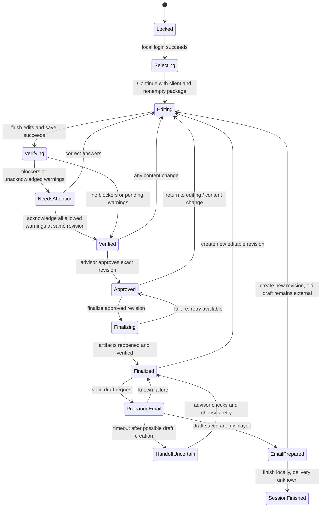

# Meeting workspace specification

## Load-bearing decisions

[State and approval ADR](../decisions/2026-09-14-state-and-approval.md), [storage and handoff ADR](../decisions/2026-09-14-local-storage-and-handoff.md).

## Problem, goals and non-goals

Keep the advisor talking with the client while entering information and inspecting forms. Optimize for one active case and keyboard use. Avoid one giant questionnaire, repeated confirmations, a configuration-heavy wizard, or an editable page-layout tool. Domain/data ownership is defined in the [mapping spec](2026-09-14-data-mapping-sync.md).

Appearance, tokens, component contracts and display dimensions belong to the [visual design system](2026-09-15-visual-design-system.md), supported by the [frontend ADR](../decisions/2026-09-15-frontend-design-system.md).

## D. User workflow

1. Log in to the local demo account.
2. Select one or more of six document cards and choose Continue.
3. Start a new fictional client, choose a saved demo client, or load the demo fixture. Create a case with the selected template/mapping versions and a client snapshot.
4. Enter facts in relevant left-side groups. Matching fields in every selected document update; the active PDF stays at the current scroll/zoom position.
5. Move between document tabs or increase document width. Edit text/choices directly; show document-only override status and reset action.
6. Choose Verify Documents. Flush pending edits and encrypted save, then check an authoritative revision of every selected document.
7. Open an issue to jump to its exact document/page/widget. Correct errors, acknowledge permissible warnings, verify again.
8. Review the preparation summary and choose Approve Package once. This records advisor approval, not a PDF client signature.
9. Generate the final package from the approved revision. Review client-facing page sets and attachment list.
10. Choose Open Outlook Draft. Open a normal Classic Outlook draft. The advisor reviews and may manually send outside the application; the demo stops with the draft open.

## E. Screen specification

### Persistent shell

NavigationRail, workflow orientation and case header persist across the authenticated workspace. Client Data and Documents focus the same active case, not separate copied state or mandatory wizard pages. New Client opens selection; Saved Cases and Settings preserve the current saved case. The five-step header reflects domain status and cannot bypass verification/approval guards. Concrete labels and collapse behavior are owned by the visual spec.

### 1. Login

- Centered compact card: application name, "Demo - fictional data only", username, password, Show password, Sign in.
- Simple local credential setup is performed before the VP meeting; no SSO or account-recovery journey. The login is a demonstration gate, not the storage encryption boundary.
- Empty state: focus username; disable submission only when required fields are blank. Enter submits.
- Error state: generic incorrect-credentials message, short throttling after repeated failures. Key-unwrapping or vault corruption is a separate storage error; never silently reset or replace existing data.
- On success show document selection or a small Resume saved case option. Lock/logout immediately hides visible PII, destroys renderer/viewer state, revokes the active session and rejects further case commands. If a save fails, retain the pending snapshot only in main-process memory for authenticated recovery; do not claim it was saved or delay the privacy lock. Reauthentication shows Save failed and offers Retry. Clear retained buffers when safely saved and released; complete memory erasure cannot be guaranteed.

### 2. Document selection

- Six cards in a three-column grid on a wide screen, two columns at narrower widths. Each shows title, real/sample badge, short purpose and page count. Card click/Space toggles selection.
- Sticky footer: selected count, Continue. Continue disabled for zero selections. No dead placeholder cards.
- No PDF preview pane on selection; Continue opens the actual viewer. Use the existing six-card catalog and metadata-driven page counts; concrete layout/copy is in the visual spec.
- Compact Resume case link. Demo fixture action remains available in workspace; no obscure settings path.
- Missing/corrupt template: card displays unavailable and cannot be selected; other cards remain usable. Never substitute a sample for a failed real template without clearly saying so.
- Adding/removing documents mid-case is a controlled selection drawer. Existing document instances retain their answers/overrides when deselected and restored in the same case. Removal excludes them from validation/export and invalidates approval. Never delete stored overrides merely on deselection.

### 3. Client / case workspace

```text
Client / Case     Saved locally       Editing > Verify > Approve > Prepare email
-----------------------------------------------------------------------------
Section rail / data fields    | draggable |  Rollover | Intake | Profile ...
Client         [complete]    | divider   |  Page 2 / 3   -  100%  +   Fit width
Contact        [1 remaining] |           |  Actual PDF canvas + interactive fields
Existing plan  [complete]    |           |
Recommendation [needs input]|           |  Field: Plan name  [Manual override]
-----------------------------------------------------------------------------
Load demo client   Focus data / Split / Focus document            Verify Documents
```

- Initial approximately 40/60 split, clamped to usable widths; draggable and keyboard-adjustable separator. Focus Data / Split View / Focus Document follow the visual spec. Focus modes hide the inactive pane completely, retain its state and show a clear switch action.
- Minimum data pane 360 CSS px and PDF pane 520 CSS px, plus an 8 px divider. When the available workspace cannot fit these, show one focused pane. A section selector replaces the section rail below the design threshold.
- Use the visual spec display matrix: 1920x1080 at 100/125%, 1366x768 at 100%, later 2560x1440; include text zoom and 150% scaling stress. Panes scroll independently; primary action remains visible.
- Only the union of required/relevant fields for the selected package appears, plus operational email and client identification. A TWS-only package should not ask for SSN, address, income, ID or beneficiaries without a use for them.
- Sections: Client, Contact, Identification, Employment, Financial, Existing Account/Plan, Suitability/Recommendation, Beneficiaries. Empty irrelevant groups disappear. Financial amounts used for this transaction are case snapshots even if future profiles retain historical information.
- Use one expanded question group with a compact section rail, not dozens of accordions simultaneously. Preserve values when navigating. Completing a field never advances focus unexpectedly.
- Fields show unobtrusive ownership where useful: "Client information" versus "This case". Plan sponsor is not labeled current employer.
- Matrix questions use reusable row controls, one topic at a time with its need and account comparisons. Offer "View full matrix" for deliberate review. Do not require scrolling a hundred individual checkbox inputs on the left.
- Save status: Saving / Saved locally / Save failed. On failure preserve input in memory, show Retry, and block Verify/Approve/Finalize until durable save succeeds. Do not claim saved merely because the renderer store changed.
- Window close waits for pending save. If saving fails, keep the window open with Retry or an explicit Discard unsaved changes and close action. OS termination/crash can lose uncommitted changes; on restart restore only the last authenticated disk revision. Do not silently discard unsaved input during normal close.
- Load Demo Client fills fictional shared/case values, leaves one defined validation issue, and reports which selected forms were populated. On a nonempty case show a replacement summary before overwriting user-entered answers; start a fresh demo case is the default low-friction alternative.
- SecureField keeps the existing masked-by-default identifier behavior. Reveal/Hide is per field; no global reveal. Policy is separate from the control so future firm defaults can differ. See Presentation Mode below.

### 4. PDF interaction

- Document tabs show title, preparation status and manual-override count. Each retains scroll, zoom and page. Default real-form opening page is 2; all pages remain accessible in private review; Presentation Mode withholds internal pages.
- Toolbar: page number/count, zoom out/in/current zoom, Fit Width, thumbnails, issue navigation and focus controls; compact overflow follows the visual spec. Scroll pages normally. Text selection layer and interactive widgets must align at zoom/scaling changes. No Print, Save As, arbitrary Open Link, import or drag-out actions. Owned menus and copy/paste restrictions follow security.
- Ordinary text fields permit direct editing; read-only client-signature areas show "Client signs later" when focused. Do not offer freehand signature insertion or page-content editing.
- Direct edit of mapped field shows a small amber dot/border and "Manual override" on focus. Context action: "Reset to synced value". The reset preview uses the latest case source. No modal on every edit.
- Direct change of an enum member updates the whole document choice group atomically. Use accessible radio-style keyboard semantics while preserving the printed square boxes. Space toggles an independent checkbox; arrows move within a configured exclusive group. Allow clearing a choice to unanswered; verification can require it later.
- Changes from master data gently highlight affected visible widgets briefly. Do not steal focus, reload the PDF, jump the page, or replace a half-typed value. Inactive documents receive state patches and hydrate accurately when opened.
- An override indicator is a status marker, not automatically a validation warning. No warning is invented without a configured rule.
- Error: if a widget cannot be identified or a page fails, keep the rest of the case and expose Retry. Block finalization of that document; do not export a stale hidden PDF.

### 5. Verification

- One results drawer/panel lists every selected document: blocking issue count, warning count, configured required-item completion, downstream signatures pending. Use text/icons as well as color.
- Red = preparation blocker; yellow = configured review warning; green = no outstanding configured issues. An acknowledged warning retains a visible warning history, even when approval is allowed.
- Count logical required questions, not every member checkbox. A Yes/No pair is one required item. Shared fields may count once per document's checklist; label the aggregate "document requirements" to avoid implying unique questions.
- Click issue: close the review drawer -> activate document -> load target page -> set viewport -> highlight exact rectangle -> focus widget and its accessible label. Keep a small Reopen review action with remaining count. If Presentation Mode hides the target/details, require an intentional exit from that mode before navigation, without showing internal snippets. If a shared fact is missing, offer "Edit client information" alongside the PDF target so the advisor can correct all forms at once.
- No issues: show "Preparation checks passed. Client signatures pending." Unconfigured business correctness is not evaluated.
- Rule/mapping engine failure is a blocker, never a green result. A pending edit or failed save prevents verification start.

### 6. Advisor approval

- Summary includes verified revision/time, selected forms, manual-override count, warning acknowledgements, and client signature status.
- One primary Approve Package action records actor/time/revision. Optional stored advisor signature may appear on this application summary, clearly labeled workflow approval, but is not stamped in these real PDFs. Storing/displaying that image is optional polish, not needed to prove approval.
- Approval disabled until all red blockers are cleared, required warnings acknowledged and latest revision verified. Main enforces these conditions independently of the button.
- Edit after approval: choose Return to editing. Show one concise notice that approval will be invalidated; subsequent keystrokes require no confirmations.

### 7. Finalization

- Finalize Package creates immutable encrypted artifacts for the approved revision, verifies them, then shows success. Use a progress indicator and preserve the approved revision on failure for Retry.
- Show client-facing attachment names/page counts and internal archive availability. Proposed intake client copy has six pages; its internal copy retains seven. The original template always remains seven pages.
- Preparation fields are read-only in client output; downstream signature/date fields remain blank and preserved. Read-only flags are not cryptographic tamper prevention. No claim of electronic-signature compliance.
- Default no merged PDF or ZIP: one client-facing PDF per selected form. This avoids cross-template field-name collisions and gives normal email attachments.
- Export to an advisor-selected folder is optional and explicitly creates ordinary external PDFs; see storage policy. No automatic Desktop/Documents export.

### 8. Email preparation

- Compact panel: To, subject, plain-text body, fixed finalized attachment list, client/internal page information. Recipient defaults to client email. Editing recipient/subject/body here changes only this email request, not the master client profile or approved PDFs.
- Subject default: "Documents for your review". Body: "Hello {firstName}, Please review the attached documents. Your advisor will confirm the appropriate next steps for signatures. Thank you, {advisorName}." Allow local template configuration outside the meeting flow.
- Validate recipient and newline/header injection constraints. Open Outlook Draft creates/displays a Classic Outlook draft with all client-facing attachments. The app has no Send button.
- Before handoff: "Outlook will open the draft. Review and send it there." Show the draft-sync limitation from security once in ordinary helper text.
- Success: "Draft opened in Outlook. Review it there." App cannot assert Sent, Delivered or Signed. Use "Finish session" only as local workflow completion.
- Outlook absent/new-only/not configured/policy blocked: keep finalized package available; show Retry and Export client PDFs, plus visible subject/body for manual use. Do not replace with a `mailto:` promise to attach files automatically.
- Ambiguous timeout: report that a draft may already exist and ask the advisor to inspect Outlook before an explicit retry. Never loop blindly creating duplicate drafts.

### Presentation Mode

- Persistent explicit toggle, visible “Presentation Mode on” status. It changes view preferences only; no canonical value, override, revision, validation rule, approval or PDF export changes. It is a privacy aid, not capture protection.
- On entry, remask all sensitive identifiers and suppress internal notes/metadata. Reveal is explicitly labeled; remask on leaving the field group, navigation, app blur and lock. Masked DOM/accessibility content never includes raw values. No automatic reveal on an issue jump.
- PDF pages shown to clients stay accurate; printed PII remains visible. A quiet toolbar note states that PDF values may be visible to viewers. Do not visually redact the actual forms or imply that masking the left pane protects the PDF.
- Internal-only pages (intake page 7), their thumbnails/search text and issue details are withheld with a neutral placeholder. A generic “Internal review required” count can remain. Reviewing internal details requires intentionally leaving Presentation Mode; merely clicking an issue must not reveal them. Validation still covers internal requirements.
- Suppress debug IDs, file paths and internal-only notes in meeting presentation; retain save failures and accurate preparation status. Audience/sensitivity metadata is versioned with mapping/rule configuration, with conservative treatment of unknown content.
- OS workstation lock/suspend always locks the app. Blur remasks; 10 minutes continuously backgrounded locks. Returning from OS lock/suspend requires local login. No foreground idle timeout in the Stage 1 demo; future firm policy is separate. See the precise lifecycle and clipboard policies in [security](../SECURITY.md).

## N. State machine

Login and selection are navigation states; the case's preparation status is persisted. Save status is orthogonal (`clean`, `saving`, `failed`) and can block transitions.



Verification/system failure returns to Editing/NeedsAttention with a blocker, not Approved. Approval stores verified revision, rule version, template/mapping hashes and acknowledged warning IDs. Finalization freezes its source revision; any concurrent edit rejects/cancels the operation. On restart restore draft/verified/approved/finalized state only after vault authentication and version/hash checks; interrupted operations become retryable or handoff-uncertain, never presumed successful.

After finalization, changes create a new revision and require verification, approval and new output. Existing Outlook drafts cannot be recalled or silently refreshed by this app; explicitly display that the older draft is stale and must be reviewed/discarded by the advisor.

## Alternatives, risks and rollout

A rigid eight-step wizard obscures quick corrections; keep one workspace with gated actions and side panels. A free-form editor alone hides reusable data; retain the split. The principal UX risk is page/control misalignment and focus loss, resolved in M0/M4 before polish. M9 tests the complete workflow with keyboard and scaled laptop display. Detailed behavior proofs are in [acceptance](2026-09-14-validation-acceptance.md).
