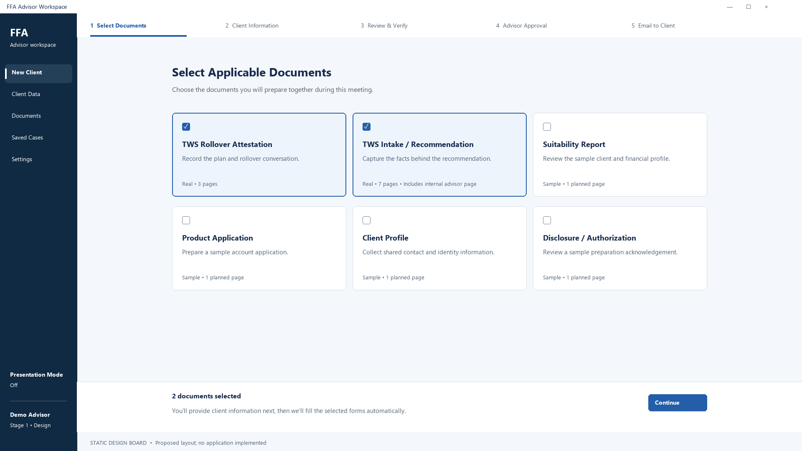
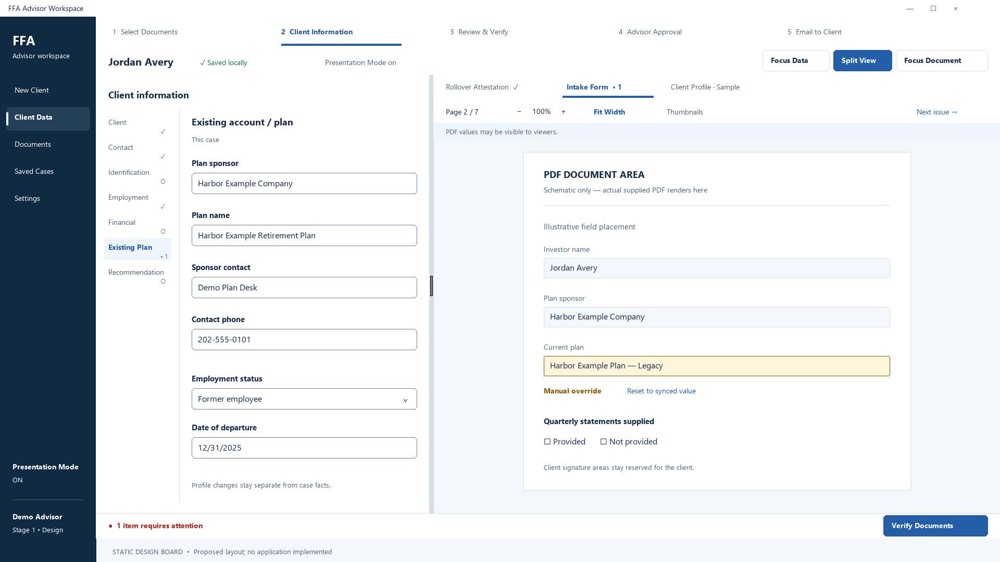

# Client-facing desktop design

## Ownership and visual intent

This document owns appearance, screen geometry and reusable component contracts. The [UX spec](2026-09-14-stage-1-ux.md) owns workflow/state behavior, [security](../SECURITY.md) owns privacy boundaries, and the [frontend ADR](../decisions/2026-09-15-frontend-design-system.md) owns library choices. No application implementation or functional prototype is included.

Design a calm wealth-management workspace: deep navy navigation, white work surfaces, restrained blue actions, generous whitespace and strong typography. Use one light work-surface theme in Stage 1. Avoid gradients, glass, nested cards, excessive pills, large radii, tiny text and dense dashboards. Actual PDFs retain their original appearance. Client-facing labels use FFA; existing technical directory identifiers need not be renamed.

## Static design boards

[Document selection board](../design-assets/document-selection.png) and [meeting workspace board](../design-assets/meeting-workspace.png) show the proposed identity at 1920×1080. They are schematic planning illustrations, not screenshots of an implemented app. The PDF area is explicitly schematic and uses no supplied PDF bytes. Exact responsive/component contracts below take precedence over illustrative geometry; the bottom design annotation is not application chrome.





## Semantic tokens

All values are proposed design tokens, not per-component literals. Expose CSS custom properties and map Tailwind utilities to these names. Neutral separators may be subtle; controls requiring a visible boundary use the stronger control border.

| Token | Value | Use |
|---|---|---|
| `nav.background` | `#102A43` | Persistent rail |
| `nav.active` | `#243F58` | Current destination; also show a leading marker and text weight |
| `nav.text` | `#FFFFFF` | Rail text/icons |
| `action.primary` | `#245EA8` | Main button, selected outline, focus |
| `action.hover` | `#1D4F91` | Hover/pressed primary action |
| `action.foreground` | `#FFFFFF` | Primary button text |
| `surface.canvas` | `#F4F7FB` | App background/PDF surround |
| `surface.work` | `#FFFFFF` | Forms, drawers, cards |
| `surface.selected` | `#EDF4FC` | Quiet selected card background |
| `border.subtle` | `#D6DEE8` | Separators and decorative outlines |
| `border.control` | `#718096` | Input/select outline |
| `text.primary` | `#172B4D` | Main text |
| `text.muted` | `#526477` | Helpers, metadata; never lower-opacity body text |
| `status.success` / `status.successSurface` | `#18704A` / `#EDF8F2` | Configured checks passed |
| `status.warning` / `status.warningSurface` | `#8A5700` / `#FFF5DB` | Warning or override detail |
| `status.blocker` / `status.blockerSurface` | `#B42318` / `#FEF3F2` | Blocking issue |
| `focus.ring` | alias `action.primary` | 2 px ring + 2 px white offset; navy rail uses white ring |

Do not communicate completion, selection, errors or overrides through color alone. Pair each with text and an icon/control state. A green result says “Configured checks passed” or “Ready for approval,” never “Compliant.” Disabled actions retain legible labels and a nearby reason; avoid faint explanatory text.

### Typography and density

Font: local `"Segoe UI", system-ui, sans-serif`; weights 400/600/700. No network requests. Numeric status/page/amount displays may use tabular numerals. Never apply application font rules to PDF canvas text.

| Role | Size / line height | Weight |
|---|---|---|
| Application identity | 20 / 28 px | 700 |
| Page title | 28 / 36 px | 600 |
| Section title | 18 / 26 px | 600 |
| Body and field input | 16 / 24 px | 400 |
| Field label | 15 / 22 px | 600 |
| Helper text | 13 / 20 px | 400 |
| Toolbar, navigation, status, buttons | 14 / 20 px | 400 or 600 |

Spacing scale: 4, 8, 12, 16, 24, 32, 40, 48 px. Standard field/button height 40 px; primary footer action 44 px; field label gap 8 px; field rows 16 px apart; question groups 24 px apart; section padding 24 px (16 at compact widths). Text areas start at 96 px. Target roughly 5–7 ordinary rows in the shorter meeting viewport, not all sections at once. Labels stay above inputs, never placeholder-only.

Controls radius 6 px; document cards 8 px; drawers 10 px at exposed corners. Shadow token `0 2px 8px rgb(16 42 67 / 8%)` for elevated overlays only. Use separators instead of cards inside cards. Icons 18–20 px; icon-only buttons retain a 40 px hit target, label and tooltip. Checkbox glyphs 18 px with their full label/card as the larger target.

## Desktop shell and coordinate model

Measurements below are CSS pixels / Windows device-independent pixels (DIPs), not physical pixels. Native title-bar/work-area deductions must be measured on the packaged build. Use the normal Windows title bar initially; do not invent custom minimize/maximize/drag regions during the PDF feasibility spike.

- Rail: 184 px expanded at client width ≥1600; 64 px icon rail below. Compact rail has keyboard-accessible labels/tooltips and an explicit navigation expander. Expansion overlays temporarily when space is constrained rather than crushing the workspace.
- Rail top: FFA / Advisor workspace. Main destinations: New Client, Client Data, Documents, Saved Cases, Settings. Bottom: Presentation Mode, advisor identity and app version. Compact identity/version detail opens from one labeled account control.
- New Client leads to selection; Client Data and Documents focus the respective pane of the active case. Saved Cases opens the encrypted case list. Settings is outside the meeting flow. Preserve/save the current case when navigating; pending-save handling follows the UX spec.
- Workflow header: 56 px, light surface, five labels: **1 Select Documents · 2 Client Information · 3 Review & Verify · 4 Advisor Approval · 5 Email to Client**. Current step uses text weight/underline, completed steps a check. At constrained widths show the current label and “Step n of 5,” with an accessible progress list available. It is orientation, not a five-page wizard or a permission bypass.
- Case header: 56 px inside workspace: fictional client name, SaveStatus, focus presets. Footer: 64 px within main area, stable primary action at right and short status at left. Content reserves footer space so it never covers controls.
- Minimum supported usable client viewport: **960 × 600 DIP** excluding native title bar. Configure window minimums using the measured chrome and available Windows work area; never force a window off-screen. Below this usable size use focused-pane fallback and a nonblocking size hint; do not claim full support.

## Screen 1: Select Applicable Documents

```text
NAV         1 Select Documents   2 Client Information   3 Review & Verify ...
            Select Applicable Documents
            Choose the documents you will prepare together during this meeting.

            [✓ TWS Rollover      ] [✓ TWS Intake /       ] [□ Suitability       ]
            [  Attestation      ] [  Recommendation    ] [  Report            ]
            [  Real · 3 pages   ] [  Real · 7 pages     ] [  Sample · n pages  ]

            [□ Product          ] [□ Client Profile     ] [□ Disclosure /      ]
            [  Application      ] [                     ] [  Authorization    ]
            [  Sample · n pages ] [  Sample · n pages   ] [  Sample · n pages  ]

            2 documents selected                                  [ Continue ]
            You'll provide client information next, then we'll fill
            the selected forms automatically.
```

Retain the existing product catalog: two real supplied forms plus four functional samples. The owner's alternative names are visual examples; renaming them would change the existing mapping/demo scope without improving selection. Each sample is planned as one page in the product spec; final displayed counts come from the generated catalog in M3. Real intake card states “Includes internal advisor page” in secondary text.

Main content max width 1280 px, centered within available area with 32 px gutters (24 compact). Grid uses three equal columns when content width ≥1008 px, two ≥640 px, one below. Gap 16 px; card min height 176 px and min width 304 px in the three-column layout. Title 18/26, description at most two short lines, type/page count below. Use a real checkbox with the card label; avoid a nested clickable button and checkbox.

Selected state: primary outline 2 px, pale selected fill, checked box; hover uses subtle border emphasis. Zero selection disables Continue with “Select at least one document.” Footer count and instruction remain visible. Selection remains focused: **no PDF preview pane here**. Continue opens the real PDF workspace; this avoids shrinking cards and asking clients to assess unreadable thumbnails. Missing-template behavior and mid-case changes remain in the UX spec.

## Screen 2: Meeting workspace

```text
NAV       Client Information → Review & Verify → Advisor Approval → Email
          Jordan Avery     ✓ Saved locally       Focus Data | Split | Focus Document
          ┌───────────────────────────┬────────────────────────────────────────┐
          │ Client information        │ Rollover   Intake • 1   Profile Sample │
          │ Client ✓  Contact ✓       │ Page 2 / 7   − 100% +   Fit Width      │
          │ Existing Plan •1  ...      ├────────────────────────────────────────┤
          │                           │                                        │
          │ This case                 │              ACTUAL PDF                │
          │ Plan sponsor              │       canvas + aligned widgets         │
          │ [Harbor Example Company]  │                                        │
          │ Plan name                 │                                        │
          │ [Harbor Example Plan   ]  │                                        │
          │                           │ Manual override · Reset to synced value│
          └───────────────────────────┴────────────────────────────────────────┘
          1 item requires attention                         [ Verify Documents ]
```

Split View defaults to about 40% data / 60% PDF, clamped to **data ≥360 px, PDF ≥520 px**, divider 8 px with a larger pointer hit area. Left content max width 560 px. Show a 136 px vertical section rail only when the data pane is ≥640 px; otherwise use one labeled section selector with completion text and Previous/Next section actions. Do not create horizontally scrolling section chips. At content width below 888 px (360 + 8 + 520), replace split with one focused pane; remember each pane's scroll and the last valid split. Focus presets fully hide the inactive pane, retaining an obvious switch control. They do not leave a sliver of unusable content.

Divider has separator semantics, accessible name/value, arrow-key adjustments of 16 px, Home/End clamped to legal extremes, and double-click reset. PDF Fit Width recomputes from available width; preserve current page/field anchor without unexpected jumps. Data and PDF scroll independently; headers and action footer stay fixed. At left content ≥480 px, pair short related fields in two columns; otherwise one column. Long names/address/choice questions remain full width.

Only relevant sections appear; completion uses “Complete,” “2 remaining,” or “Not started” with icons. Long matrix questions remain topic-based controls as specified in UX. Tab follows visible reading order; Enter commits single-line fields without submitting the whole case or advancing the workflow. Enter inserts a newline in multiline fields; Space/Enter activate buttons, and configured radio groups use arrows. No automatic focus progression.

## PDF surface and verification design

DocumentTabs: 44 px high, short meaningful names, status text available accessibly. At overflow use a labeled document selector listing all documents instead of tiny tabs. Toolbar: min 48 px, page input/count, zoom controls/current zoom, Fit Width, thumbnails toggle, issue navigation and Focus Document. Secondary controls move to an owned More menu when needed; never hide page navigation. Thumbnails start closed.

PDF widgets use subtle primary outlines on focus, application focus rings and owned accessible labels. Keep printed text/content accurate. Show ManualOverrideIndicator adjacent to the selected widget or in an anchored inspector strip, never covering printed text. Amber means document-specific value, not automatically a warning. “Reset to synced value” is a direct action. Source updates may fade a pale background once within 180 ms; no animation during typing, page reload, scroll jump or focus stealing. Reduced motion removes transitions entirely.

Verify Documents opens VerificationDrawer, 440 px wide on roomy screens. It overlays the workspace temporarily and uses dialog semantics/focus containment; at compact widths it fills the main content area. Header: “Document Review”; per-document configured readiness; aggregate “Document requirements: x / y complete”; Blocking Issues then Warnings. Issue example: **Quarterly statements supplied is required · TWS Intake · Page 2 · Go to field**. Do not use DOB/SSN examples on the real TWS forms, which lack those fields.

Go to field closes the drawer, restores the workspace, activates the document, loads/positions the target and focuses its widget. A concise status strip keeps the remaining issue count and Reopen review action. On Escape/Close without navigation, return focus to Verify Documents. Failed target navigation shows an explicit unavailable-field error and never pretends focus succeeded. Internal-only issues follow Presentation Mode restrictions in UX. Long drawers scroll internally; actions are never below an inaccessible viewport edge.

## Approval and email screens

ApprovalSummary uses a centered max-720 px work surface, not a modal stack: document count, zero blockers, override count, acknowledged warnings and “Client signatures pending.” Primary Approve Package is distinct from subsequent Finalize Package. Optional advisor signature is confined to the labeled advisor approval area. Returning to editing follows revision invalidation; visual progress does not relax domain guards.

EmailPreview reuses this width: To, Subject, Message, fixed verified attachment list with filenames/page counts, and **Open Outlook Draft**. Above the button: “Outlook will open the draft. Review and send it there.” Display the existing draft-sync boundary once here in ordinary helper text, not a scary banner. No Send button, sent checkmark or fabricated delivery status.

## Presentation and secure fields

Persistent rail toggle and header text “Presentation Mode on” are visible while active. Use the same type scale, not huge tablet controls. Presenting suppresses internal notes/debug metadata; SaveStatus and actionable save failures remain. Default sensitive identifiers stay masked, preserving the existing UX. The owner allowed initially visible values but did not require them; retain the safer existing default and define a policy-driven SecureField so a future firm can choose defaults without rewriting forms.

SecureField accepts sensitivity, presentation policy, masked formatter and editable value through the form boundary. Masked display contains only the masked string in DOM/accessibility text/title; never keep an unmasked off-screen input or tooltip. Reveal is per field, labeled “Sensitive value visible” with Hide; remask on focus leaving the field group, section/document navigation, app blur, Presentation Mode entry and lock. Switching Hide never erases the canonical value. Paste into an authorized focused editor is supported. No auto-reveal for validation. See security for copy restrictions and memory limits.

The PDF toolbar in Presentation Mode has a quiet persistent note: **“PDF values may be visible to viewers.”** Internal-only pages/tabs use a neutral withheld-content placeholder; thumbnails, text search, issue snippets and accessibility content must follow the same audience filter. Reviewing these pages requires leaving Presentation Mode intentionally. This is UI filtering, not PDF redaction, encryption or capture prevention. No masking is painted over printed client-visible PDF values.

## Reusable components

| Component | Responsibility |
|---|---|
| AppShell / NavigationRail / WorkflowProgress | Persistent layout, destinations and non-wizard orientation |
| DocumentCard / DocumentTabs | Catalog selection and active document/status |
| SectionRail / SectionForm / FieldRow | Relevant section navigation, RHF composition and consistent labels/errors |
| SecureField | Policy-based masking/reveal and restricted clipboard behavior |
| StatusBadge / ManualOverrideIndicator / SaveStatus | Compact icon-plus-text state; mostly inline text, not pill decoration |
| PdfWorkspace / PdfToolbar | Divider/presets, adapter host and owned viewer actions |
| VerificationDrawer / ValidationIssue | Configured result summaries, acknowledgements and reliable field navigation |
| ApprovalSummary / EmailPreview | Exact-revision package review and explicit external draft handoff |

Use owned Button, Input, Select, Checkbox, RadioGroup, Tooltip and Dialog primitives underneath these compositions. Avoid a new bespoke component for every screen row. Status/live regions announce committed status transitions politely, not each keystroke. The PDF adapter owns widget semantics independent of shadcn.

## Display and accessibility acceptance matrix

| Display | Approximate maximum DIP area before chrome | Expected layout / checks |
|---|---|---|
| 1920×1080 at 100% | 1920×1080 | Expanded rail; 3 cards/row; split; readable document at fit width |
| 1920×1080 at 125% | 1536×864 | Compact rail; 3 cards if content threshold fits; split; sticky actions and independent scroll |
| 1366×768 at 100% | 1366×768 | Compact rail; 3 cards if practical, otherwise 2; split with section selector; no clipped footer |
| 2560×1440 at 100%, later also 125% | 2560×1440 / 2048×1152 | Expanded rail; capped form/selection width; additional space goes to PDF, not stretched controls |
| Resized usable viewport 960×600 | 960×600 | Compact rail; focus fallback where padding prevents legal split; reachable controls |
| App text zoom 200% and Windows 150% stress | Measured on target | Focused pane/reflow as needed; no lost controls or horizontal form scrolling; PDF has independent deliberate zoom |

Measure actual client bounds in tests; screen resolution is not an assertion of usable viewport size. Preserve visible focus and keyboard access at every size. Test no-mouse entry, separator/section/dialog focus, tab overflow, radio/checkbox widgets, reduced motion, screen reader names and error announcements. Text target ≥4.5:1, large text ≥3:1, meaningful control boundaries/focus ≥3:1 against adjacent surfaces. Subtle decorative separators are not control boundaries. [WCAG text contrast](https://www.w3.org/WAI/WCAG22/Understanding/contrast-minimum.html), [non-text contrast](https://www.w3.org/WAI/WCAG22/Understanding/non-text-contrast.html).

PDF fixed pages may need their own horizontal pan at deliberate zoom; this exception never creates horizontal form/app scrolling. Do not claim the untagged supplied PDF is fully screen-reader accessible: provide the structured form equivalent and labeled interactive widgets, and record remaining PDF reading-order limitations in M0/M4. Static design contracts are not runtime accessibility evidence.
